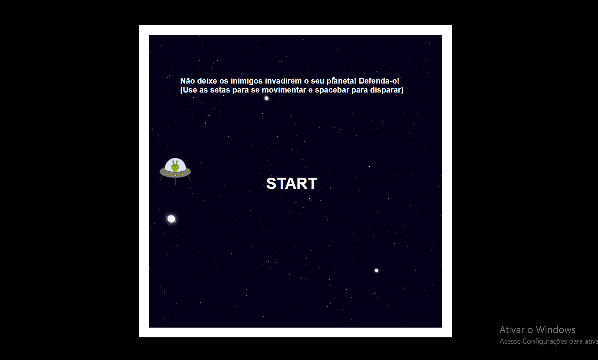
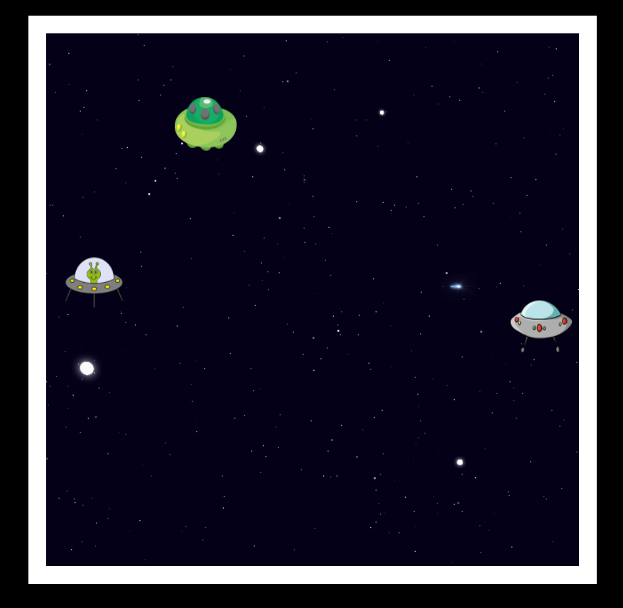
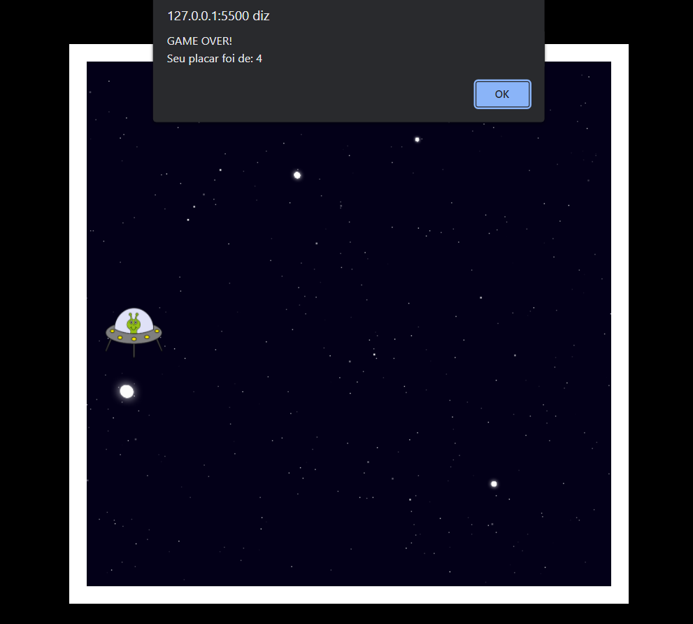

# Space Shooter by Renan
Criando  jogo de naves estilo Space Shooter web. Projeto realizado no bootcamp Órbi Web Games Developer presente na plataforma da DIO. O jogo funciona de maneira bem semelhante ao clássico Space Shooter. O usuário controla uma aeronave e deve disparar contras aeronaves inimigas com o objetivo de impedir que as mesmas cheguem ao limite esquerdo da tela do jogo. Caso o usuário perca, um alert o notificará que deu "GAME OVER" e mostrará seu placar.

### Utilizei das seguintes tecnologias: HTML5, CSS3 e JavaScript.

# Imagens
## Tela inicial:

## Imagem do jogo:

## Game over:

